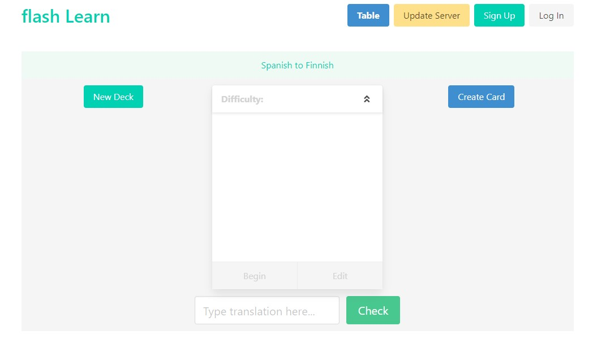
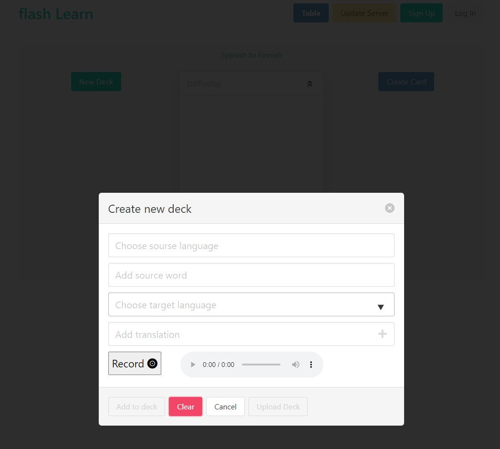
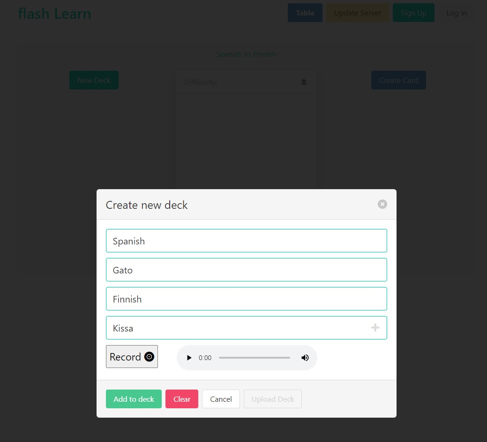
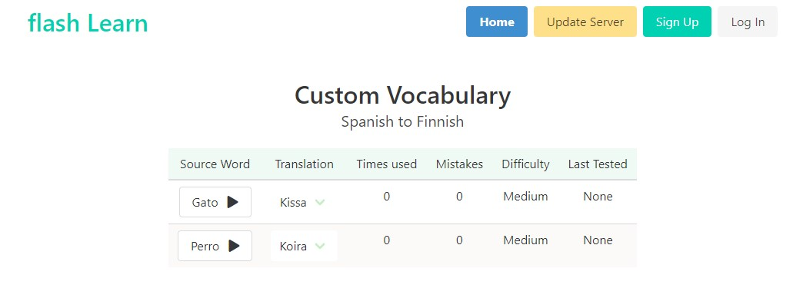

# Flash-Cards
A flashcard site to help me learn different languages. A definite work in progress.

- It serves as a companion to DuoLingo and also as its own thing.

- Your mistakes are tracked and stored in the DB. 

- The DuoLingo side pulls the vocab from your Duo account and allows you to practice with those.

- Then you can create your own custom flash cards and record your own audio and practice with those.

- It uses the vocabulary taught in Duolingo and scrapes the web to find the translations of your chosen language.

- One side of the flash card is the word to learn and the other side are the various translations.

- There can often be quite a few translations for one word, some of them a litle odd, so to narrow it down a little, I then compare the various translations against the Duo vocab of that language. 

- The user inputs their answer to test their ability and their mistakes are tracked in the database.

## Technologies
This project was created with:
- Python
- FastAPI
- Peewee ORM
- TypeScript
- Bulma CSS

 
Below is the main UI for the flash cards:

 
 
And this is what displays when the user clicks "Create" to create a new deck of flash cards:

 
 
And here is the table:

 
 

### TODO:
- Audio playback for all languages - I DID implement this way back and it worked well. But the membership to the API ran out and I haven't got around to finding an alternative, so currently playback is only for custom cards where you create the audio yourself.
- Duo functionality temporarily disabled.
- Lots and lots of refactoring...
